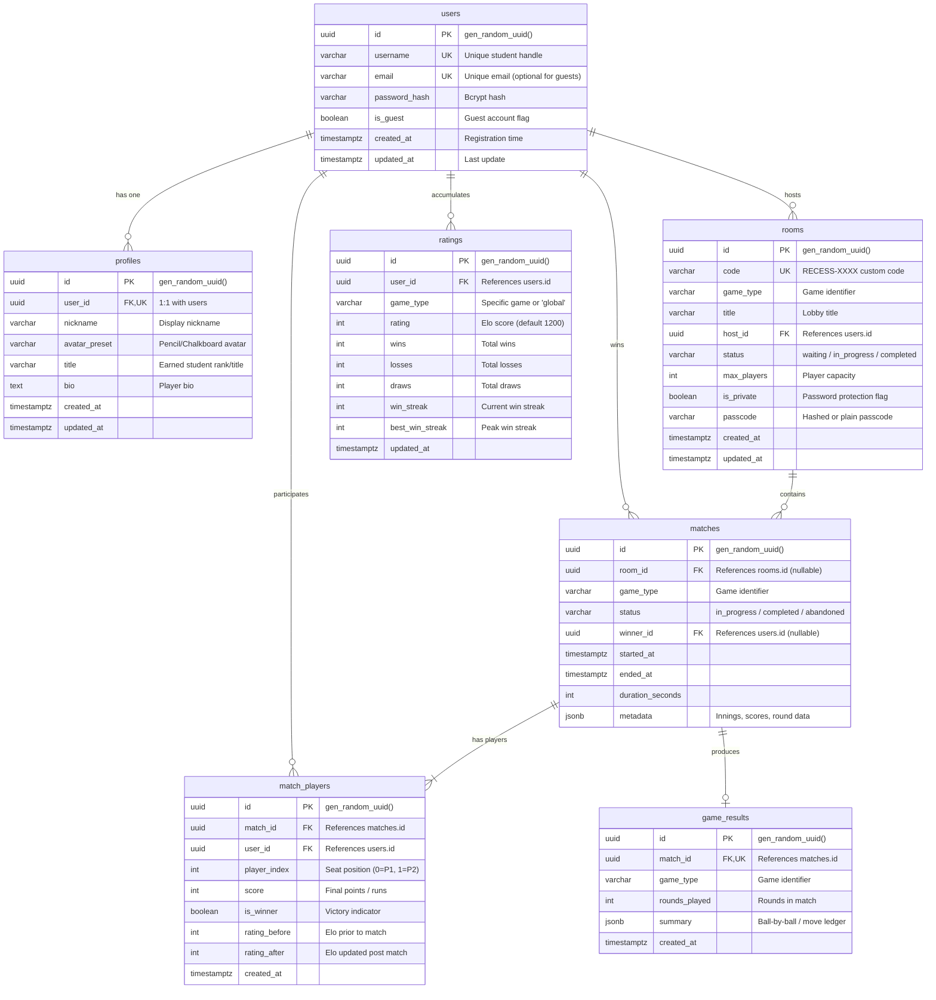

# Recess — PostgreSQL Database Architecture & Schema Design

> Production-grade persistence layer for Recess built with PostgreSQL 16, pgx/v5 connection pooling, sqlc type-safe query generation, and declarative SQL migrations.

---

## 1. Entity Relationship Diagram (ERD)



---

## 2. Table Specifications & Indexes

### 2.1 `users`
Core identity table supporting registered students and instant guest accounts.

| Column | Type | Constraints | Description |
| :--- | :--- | :--- | :--- |
| `id` | `UUID` | `PRIMARY KEY DEFAULT gen_random_uuid()` | Unique user identifier |
| `username` | `VARCHAR(50)` | `UNIQUE NOT NULL` | Unique classroom handle |
| `email` | `VARCHAR(255)` | `UNIQUE` | Email (NULL for guests) |
| `password_hash` | `VARCHAR(255)` | | Bcrypt password hash |
| `is_guest` | `BOOLEAN` | `NOT NULL DEFAULT false` | Guest session flag |
| `created_at` | `TIMESTAMPTZ` | `NOT NULL DEFAULT NOW()` | Account creation time |
| `updated_at` | `TIMESTAMPTZ` | `NOT NULL DEFAULT NOW()` | Last update timestamp |

**Indexes**:
- `idx_users_username` on `users(username)` (Fast lookups during auth)
- `idx_users_email` on `users(email)` WHERE `email IS NOT NULL` (Sparse index for auth)
- `idx_users_created_at` on `users(created_at DESC)` (Activity auditing)

---

### 2.2 `profiles`
Player customization, avatar styling, titles, and bio.

| Column | Type | Constraints | Description |
| :--- | :--- | :--- | :--- |
| `id` | `UUID` | `PRIMARY KEY DEFAULT gen_random_uuid()` | Profile ID |
| `user_id` | `UUID` | `UNIQUE NOT NULL REFERENCES users(id) ON DELETE CASCADE` | 1:1 user relation |
| `nickname` | `VARCHAR(50)` | `NOT NULL` | Display name |
| `avatar_preset`| `VARCHAR(50)` | `NOT NULL DEFAULT 'pencil_sketch_1'` | Avatar asset key |
| `title` | `VARCHAR(100)`| `NOT NULL DEFAULT 'Classroom Rookie'`| Earned classroom honor |
| `bio` | `TEXT` | `NOT NULL DEFAULT ''` | Custom notebook quote |
| `created_at` | `TIMESTAMPTZ` | `NOT NULL DEFAULT NOW()` | Creation timestamp |
| `updated_at` | `TIMESTAMPTZ` | `NOT NULL DEFAULT NOW()` | Last modification |

**Indexes**:
- `idx_profiles_user_id` on `profiles(user_id)`

---

### 2.3 `rooms`
Real-time lobby instances for multiplayer matchups.

| Column | Type | Constraints | Description |
| :--- | :--- | :--- | :--- |
| `id` | `UUID` | `PRIMARY KEY DEFAULT gen_random_uuid()` | Internal room UUID |
| `code` | `VARCHAR(16)` | `UNIQUE NOT NULL` | Human-readable code (`RECESS-7X9P`) |
| `game_type` | `VARCHAR(32)` | `NOT NULL` | Target school game identifier |
| `title` | `VARCHAR(100)`| `NOT NULL` | Room lobby title |
| `host_id` | `UUID` | `NOT NULL REFERENCES users(id) ON DELETE CASCADE` | Host player reference |
| `status` | `VARCHAR(20)` | `NOT NULL DEFAULT 'waiting'` | `waiting` / `in_progress` / `completed` |
| `max_players` | `INTEGER` | `NOT NULL DEFAULT 2` | Maximum seat capacity |
| `is_private` | `BOOLEAN` | `NOT NULL DEFAULT false` | Privacy flag |
| `passcode` | `VARCHAR(64)` | | Optional room passcode |
| `created_at` | `TIMESTAMPTZ` | `NOT NULL DEFAULT NOW()` | Created timestamp |
| `updated_at` | `TIMESTAMPTZ` | `NOT NULL DEFAULT NOW()` | Last state change |

**Indexes**:
- `idx_rooms_code` on `rooms(code)` (O(1) code lookup)
- `idx_rooms_status` on `rooms(status)` (Filter active lobbies)
- `idx_rooms_game_type` on `rooms(game_type)` (Filter by game)
- `idx_rooms_host_id` on `rooms(host_id)`

---

### 2.4 `matches`
Authoritative record of completed and active game matches.

| Column | Type | Constraints | Description |
| :--- | :--- | :--- | :--- |
| `id` | `UUID` | `PRIMARY KEY DEFAULT gen_random_uuid()` | Match UUID |
| `room_id` | `UUID` | `REFERENCES rooms(id) ON DELETE SET NULL` | Origin room |
| `game_type` | `VARCHAR(32)` | `NOT NULL` | Game type |
| `status` | `VARCHAR(20)` | `NOT NULL DEFAULT 'in_progress'` | Status |
| `winner_id` | `UUID` | `REFERENCES users(id) ON DELETE SET NULL` | Winner reference |
| `started_at` | `TIMESTAMPTZ` | `NOT NULL DEFAULT NOW()` | Match start |
| `ended_at` | `TIMESTAMPTZ` | | Match conclusion |
| `duration_seconds`| `INTEGER` | `NOT NULL DEFAULT 0` | Total match elapsed time |
| `metadata` | `JSONB` | `NOT NULL DEFAULT '{}'::jsonb` | Structured round metadata |

**Indexes**:
- `idx_matches_game_type` on `matches(game_type)`
- `idx_matches_winner_id` on `matches(winner_id)`
- `idx_matches_started_at` on `matches(started_at DESC)`

---

### 2.5 `match_players`
Participating players per match, seat indexes, scores, and Elo delta tracking.

| Column | Type | Constraints | Description |
| :--- | :--- | :--- | :--- |
| `id` | `UUID` | `PRIMARY KEY DEFAULT gen_random_uuid()` | Entry ID |
| `match_id` | `UUID` | `NOT NULL REFERENCES matches(id) ON DELETE CASCADE` | Match FK |
| `user_id` | `UUID` | `NOT NULL REFERENCES users(id) ON DELETE CASCADE` | User FK |
| `player_index`| `INTEGER` | `NOT NULL DEFAULT 0` | Seat order |
| `score` | `INTEGER` | `NOT NULL DEFAULT 0` | Total points/runs |
| `is_winner` | `BOOLEAN` | `NOT NULL DEFAULT false` | Winner flag |
| `rating_before`| `INTEGER` | `NOT NULL DEFAULT 1200` | Pre-match rating |
| `rating_after` | `INTEGER` | `NOT NULL DEFAULT 1200` | Post-match rating |
| `created_at` | `TIMESTAMPTZ` | `NOT NULL DEFAULT NOW()` | Seated timestamp |

**Unique Constraint**: `UNIQUE(match_id, user_id)`

---

### 2.6 `game_results`
Deep analytical summary of completed matches (e.g. Hand Cricket ball log, NPAT category scores, Connect 4 winning vector coordinates).

| Column | Type | Constraints | Description |
| :--- | :--- | :--- | :--- |
| `id` | `UUID` | `PRIMARY KEY DEFAULT gen_random_uuid()` | Result ID |
| `match_id` | `UUID` | `NOT NULL REFERENCES matches(id) ON DELETE CASCADE` | Match FK |
| `game_type` | `VARCHAR(32)` | `NOT NULL` | Game identifier |
| `rounds_played`| `INTEGER` | `NOT NULL DEFAULT 1` | Total rounds |
| `summary` | `JSONB` | `NOT NULL DEFAULT '{}'::jsonb` | Turn-by-turn move ledger |
| `created_at` | `TIMESTAMPTZ` | `NOT NULL DEFAULT NOW()` | Logged timestamp |

---

### 2.7 `ratings`
Elo leaderboards and school records per game and globally.

| Column | Type | Constraints | Description |
| :--- | :--- | :--- | :--- |
| `id` | `UUID` | `PRIMARY KEY DEFAULT gen_random_uuid()` | Rating ID |
| `user_id` | `UUID` | `NOT NULL REFERENCES users(id) ON DELETE CASCADE` | User FK |
| `game_type` | `VARCHAR(32)` | `NOT NULL` | Game type (or `'global'`) |
| `rating` | `INTEGER` | `NOT NULL DEFAULT 1200` | Elo rating |
| `wins` | `INTEGER` | `NOT NULL DEFAULT 0` | Win count |
| `losses` | `INTEGER` | `NOT NULL DEFAULT 0` | Loss count |
| `draws` | `INTEGER` | `NOT NULL DEFAULT 0` | Draw count |
| `win_streak` | `INTEGER` | `NOT NULL DEFAULT 0` | Current streak |
| `best_win_streak`| `INTEGER` | `NOT NULL DEFAULT 0` | All-time high streak |
| `updated_at` | `TIMESTAMPTZ` | `NOT NULL DEFAULT NOW()` | Last rated match |

**Unique Constraint**: `UNIQUE(user_id, game_type)`  
**Composite Index**: `idx_ratings_leaderboard` on `ratings(game_type, rating DESC)` (Optimized for Principal's Honor Roll leaderboard queries).

---

## 3. SQL Migrations & sqlc Generation

### 3.1 Migration Structure
- `backend/migrations/000001_init_schema.up.sql`: Complete DDL creating tables, constraints, default UUIDs, and performance indexes.
- `backend/migrations/000001_init_schema.down.sql`: Teardown DDL.
- `backend/internal/database/migrate.go`: Embedded automated schema migrator executed on service startup.

### 3.2 sqlc Configuration (`backend/sqlc.yaml`)
```yaml
version: "2"
sql:
  - engine: "postgresql"
    schema: "migrations/000001_init_schema.up.sql"
    queries: "sqlc/queries"
    gen:
      go:
        package: "dbgen"
        out: "internal/database/dbgen"
        sql_package: "pgx/v5"
        emit_json_tags: true
        emit_interface: true
```

### 3.3 Regenerating sqlc Code
```bash
cd backend
sqlc generate
```
All queries compile into type-safe Go structs and queries implementing the `dbgen.Querier` interface with `pgx/v5`.
